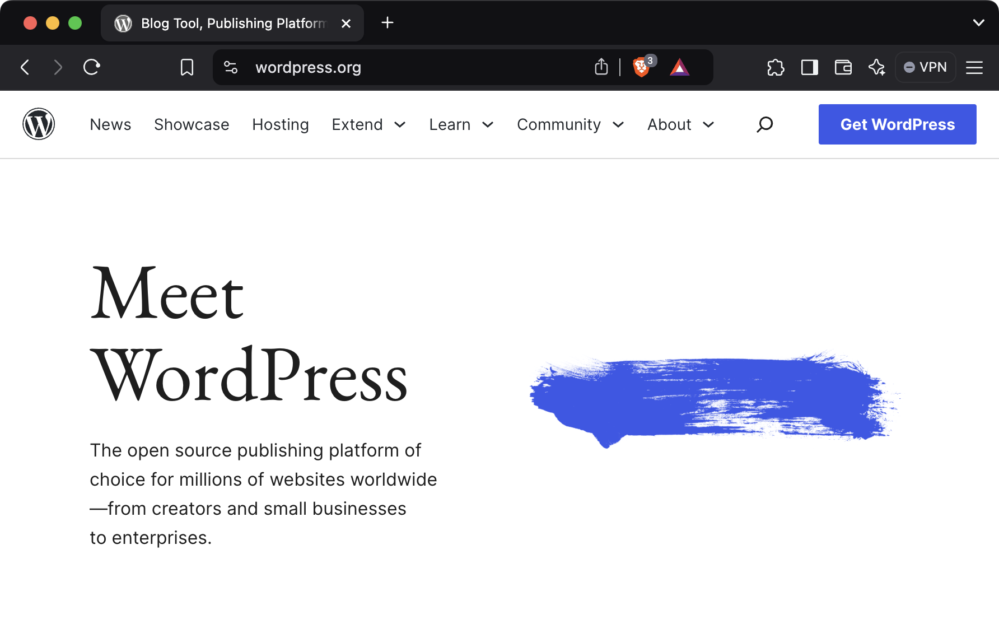
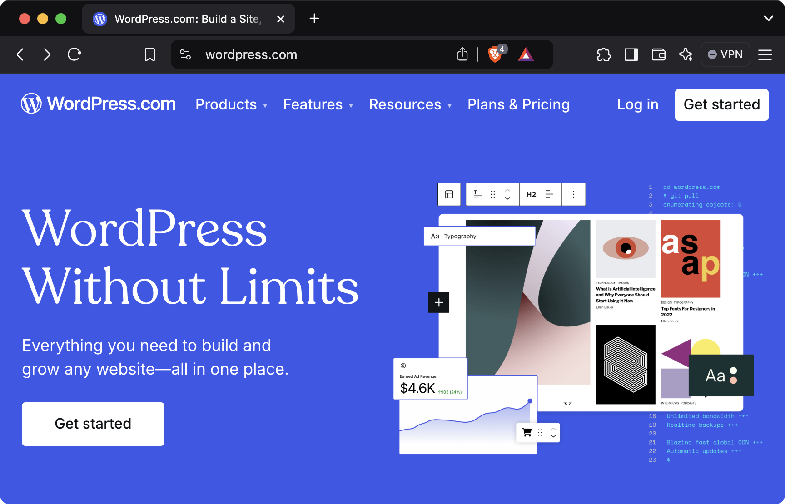
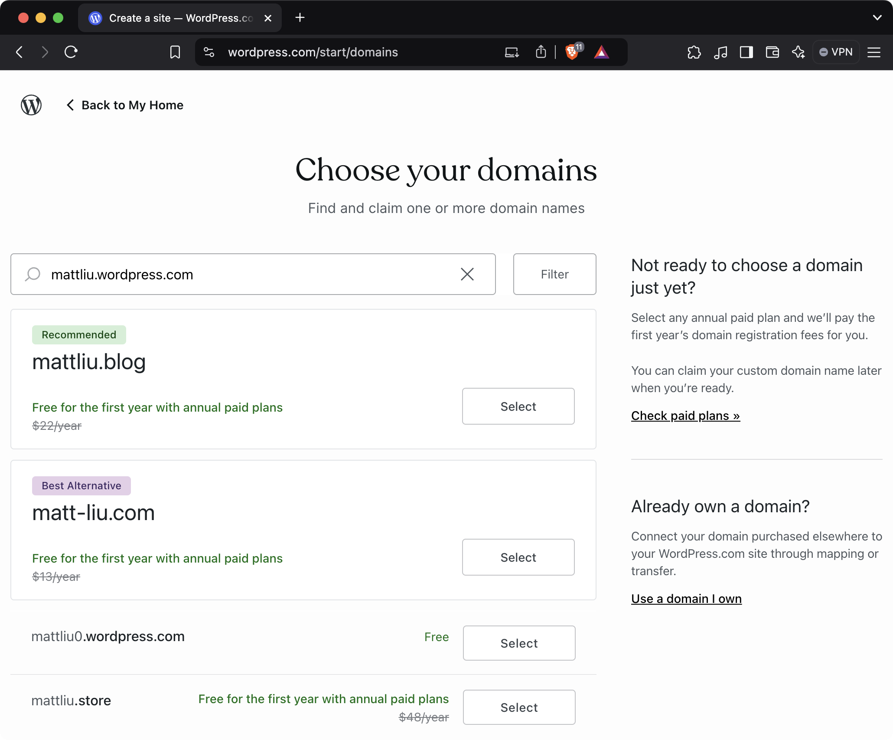
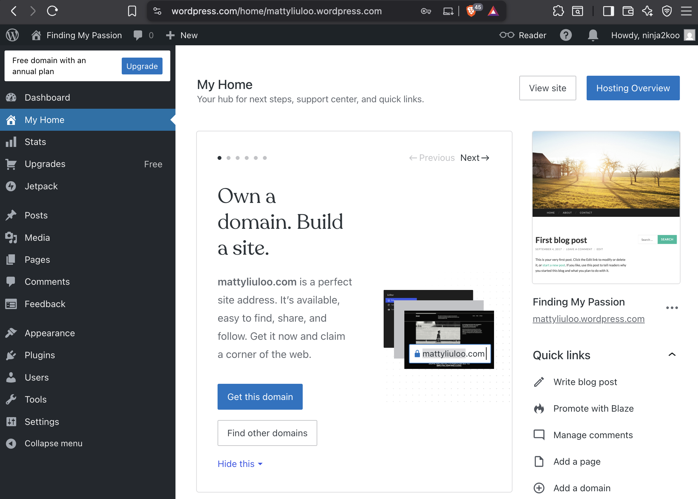

A common software tool I’ve always heard about but have never looked into are content management systems (CMS). I would always hear the acronym “C-M-S” in conversation, often followed by “like WordPress”. So to me a CMS was like a blogging app. If you are using a CMS for a blog, the simplification is decent, but CMS are not just for blogs. Content management systems allow users to create, manage, and publish their *digital* content. Digital content encompass more than blog posts. Photos, videos, audio, webpages, product listings, etc… I have had little exposure using CMS applications even though I've worked as a web developer profesionally the last 5 years. I figured it was about time I spend some time looking into CMS applications and I figured a good place to start is with the world's most popular CMS, WordPress.

<!--more-->

As of 2024 WordPress applications make up 43% of sites on the web, with CMS software more broadly making up to [68% of sites](https://www.wpbeginner.com/research/cms-market-share-report-latest-trends-and-usage-stats/#aioseo-cms-usage-statistics-2022). But WordPress is a good place to start trying to figure out what a CMS is. Right off the bat, we need to clarify what is meant when we say WordPress as there are two domains named WordPress.

## WordPress.org and WordPress.com

The difference between WordPress.org and WordPress.com is a matter of hosting. WordPress.org is the underlying tool/application and probably what most people refer to when the word “WordPress” is used. WordPress.com is a hosting service for WordPress applications and simplifies the hosting aspect to WordPress. The thing to call out here for those unfamilar with web hosting is that in order for your WordPress application to be available on the web, it needs to be hosted. While you do not need to use WordPress.com to host as there are other options for hosting (other WordPress hosting providers, self-hosting), for those less familiar with web hosting and looking to test out WordPress, a third party hosting provider to simplify the hosting process is a sensible choice. WordPress.com offers a free domain as long as your are not too particular with the domain name and is a good place to start if you are just looking to test out WordPress.

When you first start WordPress for the first time you are presented with an install screen.

This was a surprise to me because I always thought of WordPress more in line with an application like Facebook. What I mean by this is I thought I would sign up, and I could begin writing blog posts immediately. WordPress flow for a new user is not as straight forward. For one, we already mentioned was hosting. Most applications today don't really have you consider what domain you want. You typically just remember the domain the application you want to use like facebook.com for Facebook. Second is the setup. WordPress's initial dashboard screen was actually confusing for me because of my initial framing of WordPress as a blogging application.

Looking at WordPress's dashboard page after sign up, I realise I've been framing WordPress incorrectly in my mental model of what it is. WordPress should be thought of as an application that helps you build websites. If you want a blogging application, WordPress can be that. If you want a storefront, WordPress can be that as well. There are a lot of different [kinds of sites WordPress](https://wordpress.com/blog/2025/03/26/types-of-websites/) supports through the use of [WordPress Plugins](https://wordpress.org/plugins/). But if you frame WordPress as a website builder, it makes sense that WordPress users should be loosely aware of things like hosting, what a domain is, how other users will visit your site. And depending on the site that you want, you'll need to learn how to create that kind of website within WordPress's ecosystem.

After reading about the different kinds of WordPress sites, this has helped solidify what is meant by CMS. Hosting aside, I see the various kinds of digital content that WordPress supports. Its not just blog posts but any content you create as a user. Static website, news website, online courses, product listings, etc... CMS applications simplify management and distribution of this digital content and in the web world is done through a web application. I would say with my current understanding, most web applications are CMS but typically focus on a single type of content.

- instagram (images)
- youtube (videos)
- shopify (ecommerce)

I now better understand what WordPress and CMS applications are but I still do have more questions now after this review. Are most web applications CMS? What applications are not a CMS? In what situation should I use WordPress or other CMS applications? For me profesionally as a web developer, say a company wants to build a site that can be built through WordPress. When should I consider building my own web application versus using a CMS?

## Thoughts so far?

I know we have only begun to scratch the surface of what a CMS is but I am in a better spot than I once was to understand what "CMS" is when it is mentioned. I hope to continue explore using a CMS and as a web developer, if using a CMS can simplify solutions to a problem, I’d like to be able to suggest it as a legitimate option.

And with that, I will conclude this post. If you found that helpful or think I should clearify aspect to this, please reach out to me.

Till next time, Cheers!
